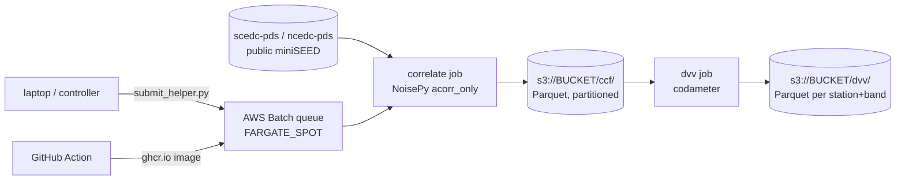

# noisepy-dvv-cloud

Cloud-scale single-station dv/v monitoring: NoisePy cross-component correlations on AWS
Fargate Spot, Parquet products on S3, robust dv/v time series with
[codameter](https://github.com/Denolle-lab/codameter).

This project is the Python successor to the Julia pipeline of
[Clements & Denolle (2023)](https://doi.org/10.1029/2022JB025553) and reuses the
deployment pattern proven by [QuakeScope](https://github.com/SeisSCOPED/QuakeScope)
(AWS Batch on a `FARGATE_SPOT` compute environment). See
[docs/seed-projects/julia-vs-python-benchmark.md](docs/seed-projects/julia-vs-python-benchmark.md)
for why we moved off SeisNoise.jl and how we plan to benchmark the two stacks.

## What it computes

For each station, independently (embarrassingly parallel — no station pairs):

1. **Correlate** — NoisePy `cross_correlate` with `acorr_only=True`, which produces the
   six same-station component pairs (EE, EN, EZ, NN, NZ, ZZ). One 24-h chunk with
   `substack=False` is already the daily linear stack (windows averaged in the
   spectral domain), so there is no separate stacking stage.
2. **Export** — daily correlation functions written to S3 as Hive-partitioned Parquet
   (one row per station-day-pair, waveform as a list column). Readable from Python,
   Julia, DuckDB, Athena — unlike the Julia `serialize` blobs of the 2022 run.
3. **dv/v** — a 5-member codameter processing ensemble per station and band (baseline
   from `codameter.use_cases` plus stack/window/reference perturbations), each member
   combined across the three cross-components (Hobiger CC² or inverse-variance,
   `--combine`), fed to `codameter.uq_measurement.processing_ensemble`. Output Parquet
   carries `dvv, dvv_err, dvv_err_within, dvv_err_method, cc, n_members` — the total
   error separates the coherence floor from the processing-choice spread.



## Repository layout

| Path | What it is |
|---|---|
| `src/noisepy_dvv_cloud/` | the pipeline package; container entrypoint is `python -m noisepy_dvv_cloud` |
| `configs/` | AWS Batch objects as `aws --cli-input-yaml` skeletons + pipeline configs |
| `docs/runbook/` | numbered operator runbook, QuakeScope style |
| `docs/parquet-schemas.md` | authoritative Parquet schemas and S3 layout |
| `docs/cost-model.md` | cloud cost model (Lambda daily dv/v, 25-year Spot backfill, moving-subarray CCFs) — regenerate with `python tools/cost_model.py` |
| `docs/seed-projects/` | seed documents for spin-off projects (Julia vs Python benchmark) |
| `docker/` | one Dockerfile per stage (the two stages have conflicting pandas pins) |
| `scripts/compare_cd2022.py` | pre-launch validation against the archived 2022 dv/v products |
| `station_lists/` | example station list (`NET.STA.LOC`, one per line, `#` comments) |

## Quickstart (local smoke test)

The two stages need **separate environments** (`noisepy-seis` pins `pandas<2`,
codameter needs `pandas>=2`) — install `.[correlate]` and `.[dvv]` in different venvs,
or use the two published containers (see `docs/runbook/02_container.md`).

```bash
pip install -e ".[correlate,dev]"   # env 1
python -m noisepy_dvv_cloud correlate \
    --stations CI.LJR. --start 2023.001 --end 2023.010 \
    --output s3://YOUR_BUCKET/smoke/ccf/
pip install -e ".[dvv,dev]"         # env 2
python -m noisepy_dvv_cloud dvv \
    --stations CI.LJR. --ccf s3://YOUR_BUCKET/smoke/ccf/ \
    --output s3://YOUR_BUCKET/smoke/dvv/ --use-case groundwater
```

For the real campaign, follow [docs/runbook/README.md](docs/runbook/README.md).

## Status

Scaffold (2026-08). The Batch deployment pattern, Parquet schemas, and API seams are
fixed; the correlation and dv/v stages need their first end-to-end smoke test against a
single CI station before scaling out.

## Key version pins

- `noisepy-seis` with `noisepy-seis-io==0.3.5` (older io versions have incompatible
  config field names)
- `codameter` pinned: the dv/v estimators are reached through
  `codameter.deviations.run_pipeline`, which currently sits on a non-public module —
  pin the version this repo was tested against before upgrading.
- Python 3.10 (intersection of noisepy `<3.11` and codameter `>=3.10`)
