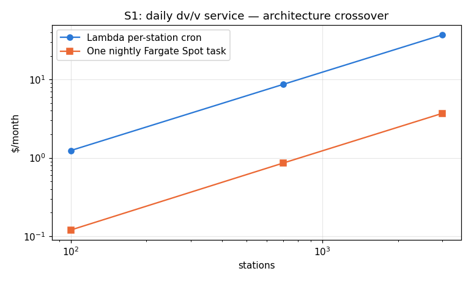
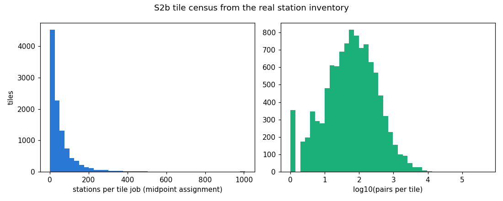

# Cloud cost model — NoisePy + codameter on Fargate Spot

How small can the bill go for science-scale ambient-noise jobs? Three
scenarios, every number traceable to a measured anchor, a dated AWS list
price, or the real station inventory. Regenerate with
`python tools/cost_model.py`.

**Calibrated against the deployed pipeline, 2026-09-23.** S2a is now
costed from a direct measurement of the shipped correlate and dv/v stages
rather than from component benchmarks. The component anchors below are kept
because S1 and S2b describe workloads that have never been run, and because
the gap between them and the measurement is itself worth reporting.

Two things the first version of this model got wrong, both now fixed:

- it assumed a **2x speedup across the two vCPUs**. Measured: 0.99x.
  `job_definition_correlate.yaml` had already recorded why — "NoisePy's thread
  pool measured only ~1.7x speedup on 4 threads (GIL-bound ifft loop)".
- it priced **8 GB** while the job definition requests 16 GB.
  Memory is roughly half the correlate bill at that shape.

Together those made it ~3x optimistic per station-day. The component timing
anchor itself was sound: 6.79 cpu-s
per station-day predicted at 20 sps against 6.36 s measured.

## Anchors

### Measured on the deployed pipeline (2026-09-23)

| parameter | value | provenance |
|---|---|---|
| correlate, per station-day | 6.36 s wall @ 2 vCPU | 75 Fargate Spot jobs, 3 stations x 2 yr SCEDC BH?, 40 sps, no response removal, 6 acorr pairs; least-squares over 10- and 30-day shards |
| correlate, fixed per job | 21.6 s | same fit (image start + StationXML catalogue) |
| correlate task shape | 2 vCPU / 16 GB | `dvvcloud2026_correlate:1` |
| dv/v, per station-day | 0.039 s | `dvvcloud2026_dvv:1`, 660 station-days in 51.4 s vs 10 in 26.0 s |
| dv/v, fixed per job | 25.6 s | same two points |
| dv/v task shape | 2 vCPU / 8 GB | `dvvcloud2026_dvv:1` |
| vCPU speedup achieved | 0.99x | 6.36 s wall vs 6.79 cpu-s predicted |
| **end-to-end check** | **$0.197 for 3 stations x 2 years** | what the campaign actually billed; this model replays it to $0.197 |

### Component anchors (M1 benchmarks, 2026-08-06) — S1 and S2b only

| parameter | value | provenance |
|---|---|---|
| chain s/station-day-channel (resp. removed, 20 sps) | 2.1 s | measured 2026-08-06, M1, n=124 (seisfetch three-archive validation) |
| same w/o response removal | ~1.6 s | same run, component split |
| container penalty | x1.3 | seisfetch benchmarks/RESULTS.md (recordlist parse path) |
| correlate, per pair-day (substack=False) | 0.0606 s @20 sps | measured 2026-08-06 through noisepy correlate (188 windows) |
| codameter stretching, fixed ref | 0.18 ms/day/config | measured 2026-08-06 (codavenv, 2561-sample CCFs) |
| codameter stretching, moving ref | 5.7 ms/day/config | same |
| Fargate on-demand | $0.04048/vCPU-h + $0.004445/GB-h | aws.amazon.com/fargate/pricing, 2026-08-06; QuakeScope runbook cross-check |
| Fargate Spot discount | 70% | AWS states "up to 70%"; floats with demand |
| Lambda | $1.66667e-05/GB-s + $0.2/M req | aws.amazon.com/lambda/pricing, 2026-08-06 |
| S3 | $0.023/GB-mo, GET $0.0004/1k, PUT $0.005/1k | list rates |
| station inventory | 22191 broadband stations active 2000-2025 | QuakeScope networks/*.zip (58,479 raw entries) |

Regions: run SCEDC/NCEDC jobs in us-west-2, EarthScope jobs in us-east-2
(bucket co-location; EarthScope direct S3 needs credential refresh). Reading
the open buckets in-region is free; cross-region is $0.02/GB and shows up as
a design error, not a budget line.

## S1 — Lambda daily dv/v service

One EventBridge rule -> one invocation per station per day: fetch the new
day file, seisfetch chain with response removal (S1 is a design, not the
shipped pipeline, which uses NoisePy without seisfetch), 6 cross-component
pair-days, append CCF rows (Parquet on S3), incremental 60-config codameter
update against the reference stack, write dv/v rows. ~13 s per
invocation at 1 vCPU-equivalent (1769 MB).

|   stations |   sec/invocation |   $ compute/mo |   $ requests/mo |   $ S3 req/mo |   $ storage/mo (yr1) |   $ total/mo |   $/station-day |
|-----------:|-----------------:|---------------:|----------------:|--------------:|---------------------:|-------------:|----------------:|
|        100 |             12.9 |           1.15 |          0.0006 |          0.03 |                 0.05 |         1.24 |         0.00041 |
|        700 |             12.9 |           8.07 |          0.0043 |          0.24 |                 0.36 |         8.68 |         0.00041 |
|       3000 |             12.9 |          34.61 |          0.0182 |          1.02 |                 1.54 |        37.18 |         0.00041 |

Alternative: skip Lambda entirely — one nightly 2 vCPU Fargate Spot task
sweeps every station sequentially:

|   stations |   nightly wall (h) |   $ total/mo |   $/station-day |
|-----------:|-------------------:|-------------:|----------------:|
|        100 |               0.28 |         0.25 |           8e-05 |
|        700 |               1.94 |         1.75 |           8e-05 |
|       3000 |               8.31 |         7.48 |           8e-05 |

**Read**: the per-station Lambda costs ~$0.01/station-month — and the
Lambda free tier (400k GB-s/month) covers the first ~500 stations outright,
so a public "live dv/v" pilot on EarthScope runs for approximately $0. The
nightly Fargate sweep is ~10x cheaper per station-day at scale; the choice
is operational (per-station isolation, retries, event-driven latency vs one
simple nightly task), not budgetary. Both are dwarfed by any standing
database; keep the product on S3+Parquet only.

## S2a — Fargate Spot, 25-year single-station dv/v backfill

Shards of 4 stations x 30 days on 2 vCPU / 16 GB
(`submit_helper`'s own defaults, which is what the 16 GB was
sized for), then one dv/v job per station over the whole history on
2 vCPU / 8 GB. No response removal — dv/v is
self-normalized. Includes the codameter 60-config ensemble.

Costed from the measured anchors. S1 and S2b remain component-modelled -- neither has been run -- but their compute now divides by the measured
0.99x vCPU speedup rather than an assumed 2x, since they model the
same GIL-bound NoisePy code.

`$ component model` is what the M1 component
benchmarks alone would have said on the same task shape, kept beside it so the
calibration gap stays visible rather than being quietly absorbed.

|                            |   stations |   (of which HH-only) |   mean active fraction |   station-days (M) |   correlate task-h |   dv/v task-h |   $ measured-anchor |   $ component model |   $/station |   $/station-day | wall @ maxvCpus=256   | wall @ maxvCpus=2048   |
|:---------------------------|-----------:|---------------------:|-----------------------:|-------------------:|-------------------:|--------------:|--------------------:|--------------------:|------------:|----------------:|:----------------------|:-----------------------|
| CA-broadband (SCEDC+NCEDC) |        671 |                   92 |                   0.52 |                3.2 |               6630 |            38 |                 303 |                 414 |        0.45 |        9.63e-05 | 2.2 d                 | 0.3 d                  |
| all three archives         |      22191 |                 9837 |                   0.18 |               36.1 |             104501 |           548 |                4786 |                6184 |        0.22 |        0.000133 | 34.2 d                | 4.3 d                  |

**Read**: the full California broadband archive for 25 years of
single-station dv/v is a few hundred dollars; the entire
EarthScope+SCEDC+NCEDC broadband inventory is a few thousand — the bill is
dominated by station count x active years, and HH-only stations cost
~2.5x their BH peers. At maxvCpus=2048 the whole thing drains in
about a week.

## S2b — moving-subarray cross-correlation (crustal band)

Tiles of 150 km radius stepped 30 km over the real station map; all pairs
<=300 km; 9-component CCFs at 5 sps (crustal band 0.05-1 Hz); stacks
stored sorted by interstation distance.

Geometry from the real inventory:

|                             | 0       |
|:----------------------------|:--------|
| stations                    | 22191   |
| pairs <=300 km              | 2807517 |
| pair-days (joint overlap)   | 1.3 B   |
| tiles                       | 10441   |
| median stations/tile-job    | 32      |
| median pairs/tile           | 60      |
| naive FFT duplication       | 25.6    |
| naive correlate duplication | 14.3    |
| (a) FFT duplication         | 26.2    |
| final stacks (GB)           | 303.3   |

Architecture is the cost story — the same science at three prices:

|                          |   task-hours (2 vCPU) |   $ compute (Spot) | wall @ 2048 vCpus   |
|:-------------------------|----------------------:|-------------------:|:--------------------|
| naive per-tile recompute |               2661881 |              93048 | 108.3 d             |
| (a) midpoint assignment  |               1856764 |              64905 | 75.6 d              |
| (b) two-phase FFT store  |                132219 |               4701 | 5.4 d               |

**Read**: with 30-km steps a pair sits inside ~14
tiles, so naive per-tile recompute multiplies the dominant correlation bill
by that factor — never acceptable. *Midpoint assignment* (each pair computed
only by the tile owning its midpoint) keeps the one-job-per-tile shape while
killing the correlate duplication entirely; what it cannot kill is FFT
duplication (~26.2x), because a station's pairs
scatter their midpoints over many tiles. The *two-phase* design (per-station
FFT jobs write a transient whitened-FFT store with a 30-day lifecycle; tile
jobs consume it) removes that too and is the cheapest — the FFT store rents
for pennies. Retention is the other lever:

|                     |    GB |   $/yr (S3 standard) |
|:--------------------|------:|---------------------:|
| final stacks only   |   303 |                   83 |
| + yearly substacks  |  7583 |                 2176 |
| + monthly substacks | 90994 |                25198 |

Keep final stacks + yearly substacks; monthly substacks for every pair cost
more than the entire compute. (Monthly retention restricted to pairs
< 100 km, or float16 substacks, are cheap middle grounds the store layout
should permit.)

## Sensitivity (what moves the bill)

1. **Target sampling rate** — FFT + correlate + storage all scale ~linearly.
2. **Archive span x station count** — linear; the inventory's mean active
   fraction (0.18) already
   discounts stations that were not deployed.
3. **Spot discount** — floats around 70%; on-demand is ~3.3x.
4. **Compute timing uncertainty** — no longer a guess for S2a. The
   "assume ±2x when porting to Fargate silicon" caveat this item used to carry
   was retired on 2026-09-23: the deployed anchors above are measured on
   Fargate itself, and 01_aws_setup.md records the observed
   $9.0e-05/station-day. It still applies to S1 and S2b, whose anchors remain
   single-core M1. Architecture is measured too — ARM64 ran within noise of
   x86 (ratio 1.039 ± 0.046, n=8 matched shards, 02_container.md), so Graviton
   is a ~17% price saving rather than a throughput one.
5. **Standing services** — none in any scenario by design. A DocumentDB-class
   database would exceed the entire S2a compute bill within months.

## Cheapest credible configurations

- **S1**: nightly Fargate Spot sweep + S3 Parquet, Lambda only if per-station
  isolation/latency matters. Order $10-100/month for 100-3000 stations.
- **S2a**: 2 vCPU Spot shards, 4 stations each, no
  response removal — ~$0.45/station
  for 25 years, measured-anchor costing.
- **S2b**: midpoint-assigned tiles at 5 sps, monthly substacks + final stacks
  only (never keep daily pair CCFs) — the full western-US crustal survey for
  $4,701, against
  $93,048 recomputed naively.
  The architecture, not the price list, is the whole story. Component-modelled:
  this scenario has never been run, and unlike S2a there is no measurement
  behind it.
