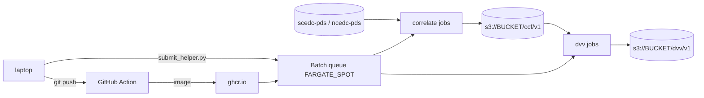

# Runbook: single-station dv/v campaign on AWS Batch

Goal: correlate N stations x M years from public S3 miniSEED archives, produce Parquet
CCF and dv/v products on S3, on Fargate Spot, for cents per station-day.

Two design rules for any campaign (inherited from QuakeScope):

1. **Everything retries — but only within a job.** Batch retries an *attempt*;
   `attempts` is capped at 10 and nothing resubmits a job that exhausts them, so a
   fleet decays to nothing while the queue still has work (QuakeScope measured
   37–53% reclaim on this account). A Spot governor outside Batch is required for
   long campaigns — [00b_cloud_hardening.md](00b_cloud_hardening.md) §4.
   Parquet shard files are content-hash-named, so a re-run of the identical submit
   command is always safe.
2. **Smoke test before scale.** One station, ten days, through both stages, before any
   command that submits more than 10 jobs.

## Phases

Start at [00_unblock_plan.md](00_unblock_plan.md) — it records what was actually
blocking the gates as of 2026-08-17 and which phases below are already satisfied.
Then read [00b_cloud_hardening.md](00b_cloud_hardening.md), which corrects three
instructions in this runbook that are verified wrong (IAM reuse, the billing
guardrail, and Gate 2's cost command) and lists the QuakeScope patterns to port
before any AWS object is created.

- [ ] **A. AWS basics** — account, CLI, billing guardrail → [01_aws_setup.md](01_aws_setup.md) (½ day first time)
- [ ] **B. Container** — push to main, GH Action builds `ghcr.io/noisepy/noisepy-dvv-cloud`, local smoke test → [02_container.md](02_container.md) (1 h)
- [ ] **C. Batch objects** — output bucket, IAM roles, compute env, queue, 2 job defs → [03_batch_setup.md](03_batch_setup.md) (½ day)
- [ ] **C2. Preflight** — `pixi run -e ops python scripts/preflight.py`, which reads roles, bucket, Batch objects and image back from AWS. Exit 0 or do not submit.
- [ ] **D. Smoke test + campaign** — 1 station gate, then submit → [04_submitting_jobs.md](04_submitting_jobs.md)
- [ ] **E. Monitor + teardown** — jobs, logs, spend cap → [05_monitoring.md](05_monitoring.md)

Troubleshooting: [06_troubleshooting.md](06_troubleshooting.md)

A note on screenshots: none. The AWS console changes too fast; we give navigation
breadcrumbs like **Console → Batch → Job queues** instead.
